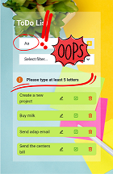

**TODO LIST** 📋 Es una aplicación que te permite gestionar tus tareas personales y/o laborales.

Podes agregar tareas y una vez realizadas podrás  marcarlas como completas ✅. 

También editar y cambiar lo que necesites o bien eliminarlas 🗑. 

📲 Podés usar esta aplicación en cualquier dispositivo ya que es totalmente *responsive* .

#### Este proyecto esta realizado con:
[Reactjs](https://es.reactjs.org/ "Reactjs")

[Vitejs](https://vitejs.dev/guide/ "Vitejs")

[Chakra UI](https://chakra-ui.com/ "Chakra UI")

##### Estos son los pasos para usar esta APP 
- Tenés que clonarte el repositorio.
- Instalar las dependencias del proyecto con el comando npm install *(Vitejs)*.
- Y ejecutar el proyecto con el comando npm run dev.

** También poder exponer el *host* para que lo visualicen en un dispositivo externo usando el comando

npm run dev -- --host
 
` VITE v4.2.0  ready in 3045 ms

  ➜  Local:   http://localhost:5173/

Y comparti este link 👇👇

  ➜  Network: http://192.***.*.***:5173/`

> OJO!! 👀 - Los dispositivos deben estar conectados en la misma red Wifi.

 

 

 

#### Hacé click acá 👇 y comenzá a administrar tus tareas facilmente.

https://todo-list-black-theta.vercel.app/

